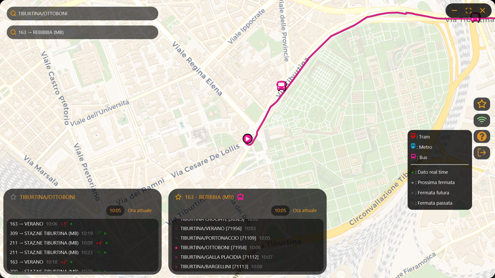

# Damose_Dionisi  

        
## Introduction

Damose_Dionisi is a desktop Java client for browsing Rome public transport data using GTFS static schedules and GTFS real-time feeds. The application provides a modern UI centered on an interactive map, search/info panels (lines, stops) and continuous vehicle updates. It supports online real-time operation and offline fallback using a local GTFS cache.

---

## Features




- Interactive map with pan & continuous zoom
- Static GTFS data: stops, routes, trips, shapes, timetables
- Real-time GTFS: vehicle positions and trip updates (periodic polling)
- Merge of static + real-time data (fast indexed lookups)
- Search: lines and stops
- Line/stop info panels with arrivals/estimates
- Favorites management and user session persistence
- Offline mode using local GTFS cache
- Integration of Swing-based tile map via `SwingNode` (JavaFX + Swing interop)    

---

## Technologies & Libraries

- Java 25 (project configured for Java 25 in `pom.xml`)
- JavaFX (OpenJFX) — declared in `pom.xml` as 21.0.6; for running from CLI/IDE use a JavaFX SDK whose major version is compatible with your JDK or align the `pom.xml`.
- Build: Maven (with `javafx-maven-plugin`) and Maven Wrapper (`mvnw`)
- Protobuf (GTFS-realtime)
- Gson (JSON)
- Apache Commons CSV
- Ikonli (icons for JavaFX / Swing)
- sqlite-jdbc (local lightweight DB for auxiliary services)
- JUnit 5 (tests)

---

## Resources used

- GTFS static files  — downloaded or provided in cache.
	- GTFS URL = "https://romamobilita.it/sites/default/files/rome_static_gtfs.zip";
- GTFS realtime feeds (trip updates and vehicle positions) — configured URLs in `Main`.
	- TRIPUPDATE URL = "https://romamobilita.it/sites/default/files/rome_rtgtfs_trip_updates_feed.pb";  
	- VEHICLEPOS URL = "https://romamobilita.it/sites/default/files/rome_rtgtfs_vehicle_positions_feed.pb";

---

## Requirements

- JDK 25 (or the JDK version you compile against) installed and `JAVA_HOME` environment variable set
- Maven (or use the included Maven Wrapper `./mvnw`)
- JavaFX SDK (if running from CLI or a run configuration that does not use the `javafx-maven-plugin`) — either the SDK matching JDK major version or align pom/dependencies accordingly
- Internet access for first-time GTFS cache download (optional if you already provide a local cache)

---

## Installation & Run

### 1. Clone repository

```bash
git clone https://github.com/<your-username>/Damose_Dionisi.git
cd Damose_Dionisi
```

### 2. Recommended: use Maven Wrapper (no global Maven required)

Windows PowerShell:

```powershell
.\mvnw clean package
.\mvnw javafx:run
```

If `mvnw` is missing, install Maven and use `mvn` instead.

### 3. If running from IDE (IntelliJ / Eclipse)

**IntelliJ (preferred if you used `mvn javafx:run` previously)**:

- Import project as Maven project.
- Ensure Project SDK = JDK 25.
- Run `mvn javafx:run` (Maven tool window) **or** create an Application Run Configuration:
    - Main class: `app.Main`
    - VM options: --module-path "C:\javafx\lib" --add-modules javafx.controls,javafx.fxml
    - Use project module classpath.

**Eclipse**:

- Install Maven integration (M2E) and import as Maven project.
- Add JavaFX SDK jars to Modulepath (Project → Properties → Java Build Path → Modulepath → Add External JARs… from `C:\javafx\lib`).
- Run Configuration → Java Application:
    
    - Project: your project
    - Main class: `app.Main`
    - VM arguments: --module-path "C:\javafx\lib" --add-modules javafx.controls,javafx.fxml

### 4. Running from CLI without Maven plugin

If you have JavaFX SDK extracted at `C:\javafx\lib`:

```powershell
mvn clean package
java --module-path "C:\javafx\lib" --add-modules javafx.controls,javafx.fxml -cp target\classes app.Main
```

Or to run packaged jar (ensure manifest `Main-Class` exists and provide module path):

```powershell
java --module-path "C:\javafx\lib" --add-modules javafx.controls,javafx.fxml -jar target/Damose_Dionisi-1.0-SNAPSHOT.jar
```

> Note: JavaFX runtime components must be available to the JVM. If you get `JavaFX runtime components are missing`, verify `--module-path` points to the JavaFX SDK `lib` folder (not Maven `.m2` artifacts), or use `mvn javafx:run`.

---

## Project structure

```
src
├───main
│   ├───java
│   │   ├───app
│   │   ├───controller
│   │   ├───model
│   │   │   └───repository
│   │   ├───operator
│   │   ├───service
│   │   └───view
│   │       ├───layouts
│   │       └───nodes
│   ├───proto
│   └───resources
│       ├───icons
│       └───META-INF
└───test
    └───java
        └───operator
```

Key packages:

- `app` — Main application entry point
- `controller` — MVC controllers
- `model` — domain objects + repositories
- `operator` — GTFS static & realtime loaders / indexers / cache / tiles manager
- `service` — app-level services (auth, connectivity, favorites)
- `view` — JavaFX views, layouts, Swing map integration (`MapPanel` in `view/nodes`)

---

## Developer notes

- The application isolates UI thread (JavaFX/Swing) from heavy work: use `Platform.runLater` for JavaFX UI updates and `SwingUtilities.invokeLater` for Swing map updates.
- GTFS realtime index updates are applied atomically (build temporary index → volatile swap → listener notify).
- Ensure the JavaFX version used at runtime is compatible with the JDK or update `pom.xml` dependency versions accordingly.

---

## Author

Giulio Dionisi

---
